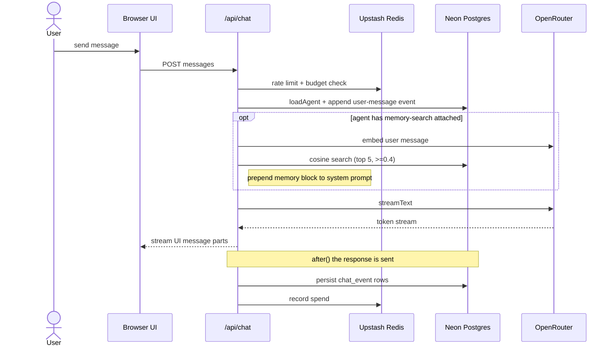
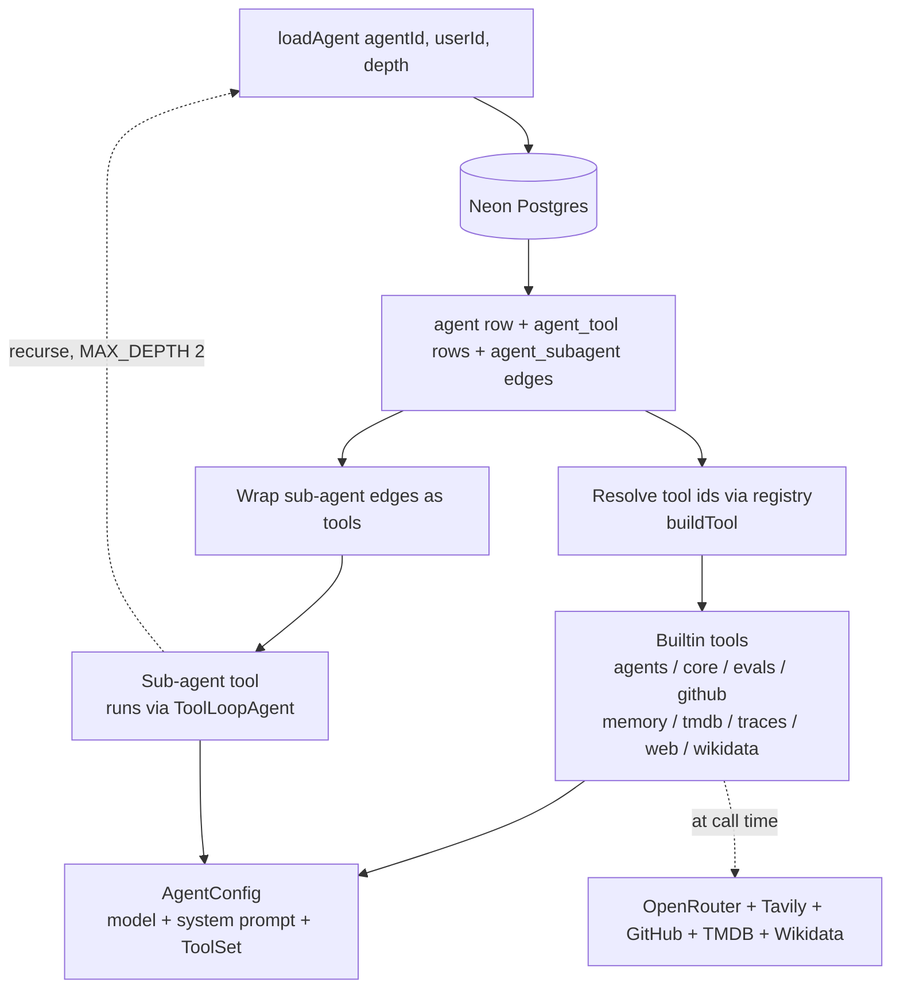
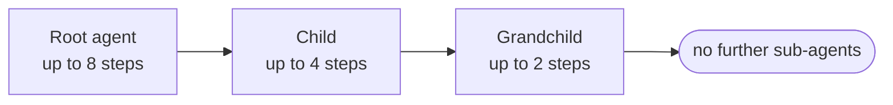
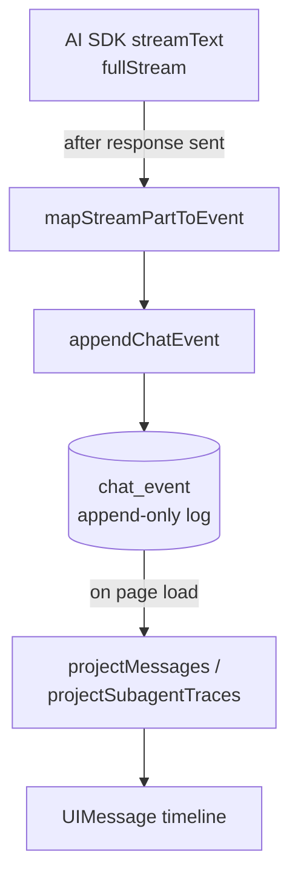

I built [comal.dev](https://comal.dev) as my capstone for the [Overclock Accelerator](/blog/overclock-accelerator-fellowship). It's an open source playground for composing your own AI agents from a shared toolbox. Pick a model, write a system prompt, attach some tools, start chatting.

A comal is the flat griddle in a Mexican kitchen. This one cooks up agents.

The fellowship post was the story. This is the tour: what it's like to use, then the handful of decisions under the hood that made it feel like a product instead of a demo.

## A lap around it

Open [comal.dev](https://comal.dev) and you're already in. Anonymous by default, no wall before the first agent. Every account starts with one agent already there: Comal.

Tell Comal what you want. "Build me an agent that summarizes GitHub issues." It picks a model, writes a system prompt, attaches the GitHub tool, and hands you back something that works. Or skip it and build the agent yourself: pick a model from the picker, each one tagged with a relative cost so you can reach for a cheap one on purpose, write the prompt, check off the tools you want from the list.

Then chat. Markdown, code, and diagrams render as the stream arrives. Drop in a file, paste an image, grab a screenshot. When the agent reaches for a tool you marked sensitive, the turn pauses for a one-click approve or deny.

Like a turn? Save it as an eval in one click. Run the suite. Watch the score trend across versions. Open any conversation's trace to see every step, every tool call, and what it cost. Diff two versions of the agent and revert if a change made it worse.

That's the product. The rest of this post is how the parts worth talking about actually work.

## What happens when you hit send

One message kicks off more than a model call. Here's a turn end to end, the path everything below zooms into:



Rate limit and budget before anything runs. Memory folded in before the first token. The model streams. Then, only after the user has their reply, the turn gets persisted and the spend recorded. Each of those is a decision worth unpacking.

## Agents you compose at runtime

Building an agent takes about a minute: a model, a prompt, a few tools checked off a list. That's the whole surface for making one.

Under it, an agent isn't code. It's three rows in a database: the model, the system prompt, and the tools you picked from a static, builtin-only registry. Everything is per-user and private. No templates, no sharing, no marketplace.

Because an agent is just that data, export falls out for free. Pull one down as a self-contained JSON file, model, prompt, tools, and any sub-agents inlined all the way down, plus its evals.

The tools are fixed at build time. You don't write new ones from the UI. You compose the ones that exist: web search, GitHub reads, memory, a pile of TMDB and Wikidata lookups. Pick a model per conversation without touching the agent. Tag every model with a relative cost label so you can reach for a cheap one on purpose.

Then the twist that makes it a playground: sub-agents. Any agent you own can become a tool for another agent. A coordinator delegates to specialists, each with their own model and tools.



One function, `loadAgent`, is the single place this happens. It reads the agent, resolves the tool ids against the registry, and turns each sub-agent link into a tool that recurses back through `loadAgent`.

Recursion needs limits, so delegation tops out at three tiers: root, child, grandchild. The step budget tightens as you go down, and the grandchild gets no sub-agents of its own. Without that, a coordinator delegating to a coordinator runs up a bill fast and is impossible to trace.



Agents calling agents you own also means you can draw a cycle: A calls B, B calls A. The fix is the part I'd point a reviewer at. Every write to an agent runs in a transaction that first locks every agent you own, not just the one being edited:

```ts
return db.transaction(async (tx) => {
  const ownerAgents = await tx
    .select()
    .from(agent)
    .where(eq(agent.userId, userId))
    .orderBy(agent.id)
    .for("update");
  // read the full sub-agent graph, check for a cycle, then write
});
```

Locking only the target agent isn't enough. Two tabs editing two different agents could each pass a cycle check against a graph that doesn't include the other's pending edit, then commit a loop between them. Locking the whole set means the cycle check and the write see the same graph. The `orderBy(agent.id)` is the other half: a deterministic lock order, so two of these transactions can't deadlock by grabbing the same rows in opposite orders.

## The chat log is the only source of truth

Open any conversation and there's a trace: every step, every tool call, token counts, the cost. The cost dashboard, the expandable sub-agent transcripts, all of it comes from one decision I'm happy with. Nothing is stored as a finished message.

When the model streams a turn, every part of that stream, each text chunk, each tool call, each tool result, each error, becomes one row in an append-only log. On page load, a projector replays the log into the message timeline you see.



The reason this is worth the trouble: three features I'd otherwise build by hand fall out of one log for free.

- **Execution traces.** Every conversation already has a step-by-step record. Timing, tool inputs and outputs, token counts. There's nothing to log separately, the trace is the log.
- **Cost.** Each turn is priced once when it finishes and written into the same log as microdollars. Nothing recomputes, so a later price change never rewrites what an old turn cost. The cost dashboard reads straight off that one column: spend by model and by conversation, a daily trend, the average per turn, and what a full eval suite run cost, over a 30, 90, or all-time window.
- **Sub-agent transcripts.** A sub-agent's inner stream writes into the same log, tagged with the parent tool call. On reload it projects into a collapsible transcript, so you can open up a delegation and see what the specialist actually did.

That last one hid a bug I still think about. The sub-agent tool is an async generator that yields its progress, then yields a final `done` payload. My first version `return`ed that final payload instead of yielding it. The AI SDK consumes the generator with `for await`, which throws away the return value, so the parent model got back empty text and acted like the specialist had said nothing. Yield the last payload, don't return it.

One append-only log, three things I didn't have to invent.

## Evals you can trust

A playground for agents is useless if you can't tell whether a change made the agent better or worse. So evals are first-class. Attach test cases to an agent and score how it responds.

There are five scorers. Three are plain string matching: `contains`, `exact`, and `levenshtein` for edit distance. The fourth, `llm-judge`, asks a model whether the answer is semantically right. The fifth is the one I care about most: `tool-call` grades behavior, not text. It reads the tool-call events out of the run's trace and checks them against an assertion, must-call, must-not-call, must-call-with-these-args. That's how you catch an agent that returned the right-looking answer by guessing instead of by calling the tool you gave it.

Two decisions made evals trustworthy.

First, an eval run isn't a special code path. It goes through the same `streamText` loop as a real conversation, tagged `kind = eval`. So it exercises the actual pipeline, and every run is a full trace you can open and inspect. A run that failed mid-stream is still a trace, so you can see where it broke.

Second, runs are sandboxed. An eval shouldn't fire off real web searches or write to your memory. So every write tool gets its real action swapped for a stub, while the tool call itself is still emitted, so the trace (and the `tool-call` scorer) can still see that the agent tried. Read tools keep working, so multi-step chains run for real. The agent thinks it saved a memory; nothing was saved.

A per-version trend chart plots the score against each config snapshot and flags any version that scored below the one before it. Regressions are visible, not discovered later.

## Memory the agents share

Attach three tools, save, search, delete, and an agent can remember things about you. The detail that makes it interesting: memory isn't scoped to an agent. It's one pool tied to your account. A fact your research agent saved is visible to your writing agent. There's a `/memories` page listing everything with a badge for which agent saved each one, and a per-user cap so it can't grow without bound.

Search is the part I tuned. When an agent has the search tool attached, I don't wait for the model to decide to call it. The chat route embeds your latest message up front and prepends the top matches to the system prompt before the first token streams, so the relevant facts are just there. It saves a whole tool-call round trip on the common case. Each fact is a 1536-dimension `text-embedding-3-small` vector in Postgres with an HNSW index for cosine search. The match threshold sits at 0.4, tuned down from the usual 0.75 because that embedding model scores lower than you'd expect; a real recall query that should clearly match landed at 0.61.

## Hardening in the seams

Week eight of the fellowship was a cold shower about treating these as production systems. Prompt injection, runaway bills, poisoned memory. Getting an agent to do the thing was never the hard part. The hard part is everyone who shows up wanting it to do something else.

The fixes all live outside the model.

- **Approval gates.** Mark a tool as needing approval and it pauses mid-stream for a one-click approve or deny. Sub-agent tools skip the gate so delegation doesn't stall.
- **Spend budgets.** Runaway usage stops at $5 an hour signed in, $1 an hour anonymous, on a sliding window, with request rate limits on top. The checks fail open: if the rate limiter is unreachable, a chat goes through rather than the limiter taking the whole app down with it.
- **Memory that can't break out.** Those injected facts go in inside a `<memory>` block, framed as context, not instructions. Before they go in, the closing tag gets stripped, so a saved fact can't end the block early and smuggle in commands. The whole defense is one blunt line: `content.replaceAll("</memory>", "")`.
- **Bring your own keys, encrypted.** Per-user API keys are AES-256-GCM encrypted at rest. A tool that needs a key you haven't set is hidden from the model entirely, so the agent never tries to use something it can't authenticate.

None of this is clever. It's the unglamorous layer that decides whether a demo survives contact with real users.

## Comal builds your agents

The playground configures itself. Comal, the system agent every account starts with, holds the agent-management tools: create, update, diff versions, revert, run evals, read traces. So Comal builds and iterates on your other agents through chat.

"Build me an agent that summarizes GitHub issues." "Write an eval for it." "It regressed, what changed?" "Revert it." The same tool-calling loop that powers any agent here, pointed at the agents themselves.

It's the same move I kept finding all fellowship: once tool calling is the primitive, the interesting systems are just tools wired to the right targets.

## Boring on purpose

The stack underneath is deliberately dull. Next.js 16, React 19, Drizzle on Neon Postgres, Better Auth. An Effect service layer where every write goes through a single atomic path. The Vercel AI SDK on top of OpenRouter, so the model picker spans frontier and low-cost models behind one interface.

Boring infrastructure is the point. It keeps the surprising part where it belongs, in the agents, not in the plumbing.

## Where it landed

comal.dev is open source ([repo](https://github.com/jimmy-guzman/comal.dev)) and live at [comal.dev](https://comal.dev). Start anonymous, sign in with GitHub if you want your agents to follow you.

I came into the fellowship dabbling with agents. I left having built a platform for them. The Fickle Wizard doesn't get less fickle. You just get better at building the rails around it.
